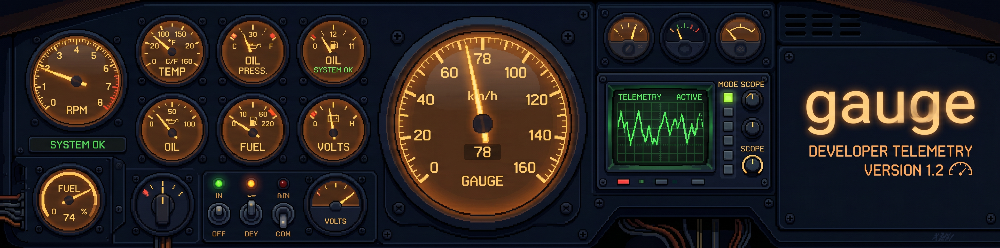
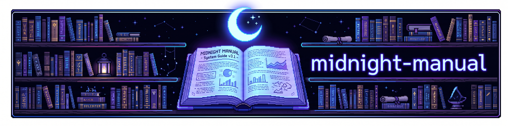

# Homebrew Tap

A custom [Homebrew](https://brew.sh) tap for installing CLI tools and MCP servers by [@aaronbassett](https://github.com/aaronbassett).

## Adding This Tap

```bash
brew tap aaronbassett/tap
```

Once the tap is added, install any formula below with `brew install`. All formulae ship pre-built binaries — no compiling from source.

## Formulae

Jump to: [agentbin](#agentbin) · [compactp](#compactp) · [gauge](#gauge) · [midnight-manual](#midnight-manual) · [rover](#rover) · [souk](#souk) · [tome](#tome)

---

### agentbin

[](https://github.com/aaronbassett/agentbin)

CLI for publishing rendered documents at public URLs — host single-page HTML sites for LLM agents.

|               |                                                                                                              |
| ------------- | ------------------------------------------------------------------------------------------------------------ |
| **Version**   | 0.1.1 ([release](https://github.com/aaronbassett/agentbin/releases/tag/agentbin-v0.1.1))                     |
| **License**   | MIT                                                                                                          |
| **Source**    | [github.com/aaronbassett/agentbin](https://github.com/aaronbassett/agentbin)                                 |
| **Platforms** | macOS (Apple Silicon · Intel) · Linux (arm64 · x86_64)                                                       |

```bash
brew install aaronbassett/tap/agentbin
```

---

### compactp

[](https://compactp.midnightntwrk.expert/)

A production-grade parser frontend for the [Compact](https://docs.midnight.network/) language (Midnight Network) — turns Compact source into abstract syntax trees.

|               |                                                                                                          |
| ------------- | -------------------------------------------------------------------------------------------------------- |
| **Version**   | 0.1.0-beta.1 ([release](https://github.com/devrelaicom/compactp/releases/tag/compactp-v0.1.0-beta.1))    |
| **License**   | MIT                                                                                                      |
| **Source**    | [github.com/devrelaicom/compactp](https://github.com/devrelaicom/compactp)                               |
| **Website**   | [compactp.midnightntwrk.expert](https://compactp.midnightntwrk.expert/)                                  |
| **Platforms** | macOS (Apple Silicon · Intel) · Linux (x86_64)                                                           |

```bash
brew install aaronbassett/tap/compactp
```

---

### gauge

[](https://github.com/aaronbassett/gauge)

Gauge client: authenticated query access, a terminal dashboard (TUI), and an MCP server for privacy-first developer telemetry.

|               |                                                                                |
| ------------- | ------------------------------------------------------------------------------ |
| **Version**   | 0.3.0 ([release](https://github.com/aaronbassett/gauge/releases/tag/v0.3.0))   |
| **License**   | MIT OR Apache-2.0                                                              |
| **Source**    | [github.com/aaronbassett/gauge](https://github.com/aaronbassett/gauge)         |
| **Platforms** | macOS (Apple Silicon) · Linux (arm64 · x86_64)                                 |

```bash
brew install aaronbassett/tap/gauge
```

---

### midnight-manual

[](https://manual.midnightntwrk.expert/)

The `midnight-manual` CLI (also installed as `mnm`); exposes an `mcp serve` subcommand for serving the Midnight Network manual to LLM agents.

|               |                                                                                                |
| ------------- | ---------------------------------------------------------------------------------------------- |
| **Version**   | 0.2.1 ([release](https://github.com/devrelaicom/midnight-manual/releases/tag/v0.2.1))          |
| **License**   | Apache-2.0 OR MIT                                                                              |
| **Source**    | [github.com/devrelaicom/midnight-manual](https://github.com/devrelaicom/midnight-manual)       |
| **Website**   | [manual.midnightntwrk.expert](https://manual.midnightntwrk.expert/)                            |
| **Platforms** | macOS (Apple Silicon) · Linux (arm64 · x86_64)                                                 |

```bash
brew install aaronbassett/tap/midnight-manual
```

> [!NOTE]
> Installs two binaries: `midnight-manual` and the `mnm` shorthand.

---

### rover

[](https://github.com/aaronbassett/rover)

An MCP server for fetching and prepping web content for LLM agents.

|               |                                                                                |
| ------------- | ------------------------------------------------------------------------------ |
| **Version**   | 0.1.0 ([release](https://github.com/aaronbassett/rover/releases/tag/v0.1.0))   |
| **License**   | MIT OR Apache-2.0                                                              |
| **Source**    | [github.com/aaronbassett/rover](https://github.com/aaronbassett/rover)         |
| **Platforms** | macOS (Apple Silicon · Intel) · Linux (arm64 · x86_64)                         |

```bash
brew install aaronbassett/tap/rover
```

> [!IMPORTANT]
> Depends on `chromium`, which Homebrew will install automatically.

---

### souk

[](https://github.com/aaronbassett/souk)

CLI tool for managing Claude Code plugin marketplaces.

|               |                                                                                  |
| ------------- | -------------------------------------------------------------------------------- |
| **Version**   | 0.1.2 ([release](https://github.com/aaronbassett/souk/releases/tag/souk-v0.1.2)) |
| **License**   | MIT                                                                              |
| **Source**    | [github.com/aaronbassett/souk](https://github.com/aaronbassett/souk)             |
| **Platforms** | macOS (Apple Silicon · Intel) · Linux (arm64 · x86_64)                           |

```bash
brew install aaronbassett/tap/souk
```

---

### tome

[](https://tome-mcp.com/)

Cross-harness plugin catalog manager for AI coding assistants.

|               |                                                                            |
| ------------- | -------------------------------------------------------------------------- |
| **Version**   | 0.7.3 ([release](https://github.com/devrelaicom/tome/releases/tag/v0.7.3)) |
| **License**   | MIT OR Apache-2.0                                                          |
| **Source**    | [github.com/devrelaicom/tome](https://github.com/devrelaicom/tome)         |
| **Website**   | [tome-mcp.com](https://tome-mcp.com/)                                      |
| **Platforms** | macOS (Apple Silicon) · Linux (arm64 · x86_64)                             |

```bash
brew install aaronbassett/tap/tome
```

## Updating

Update all formulae from this tap:

```bash
brew update
brew upgrade
```

Or upgrade a single formula:

```bash
brew upgrade aaronbassett/tap/souk
```
